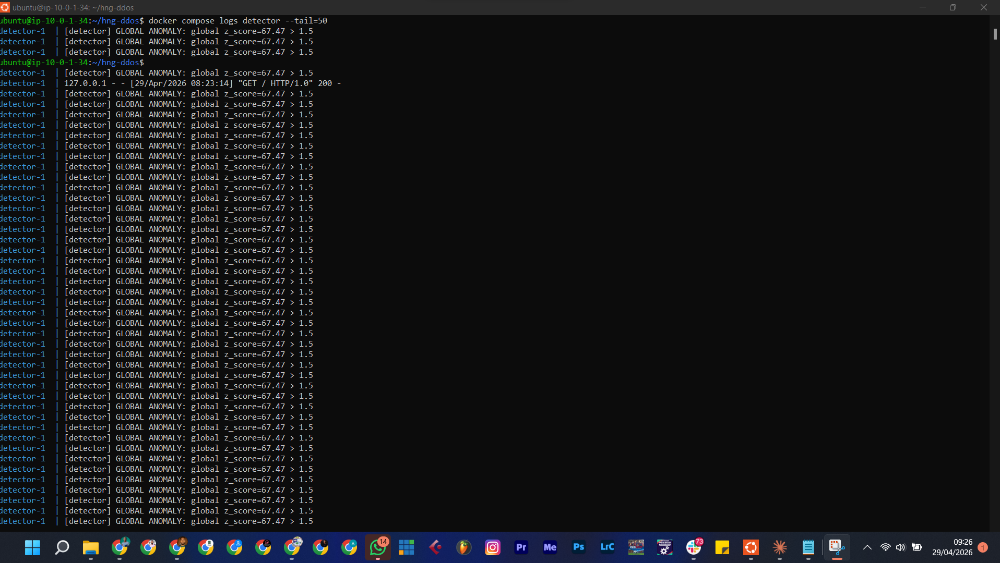
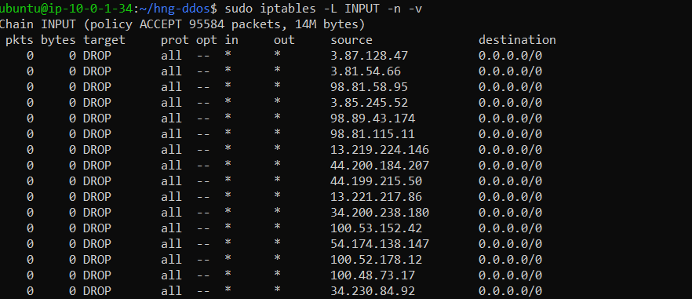
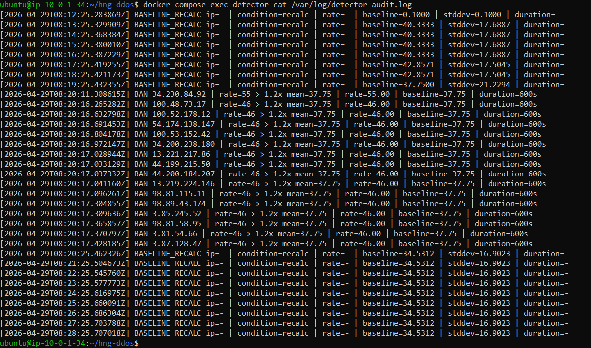
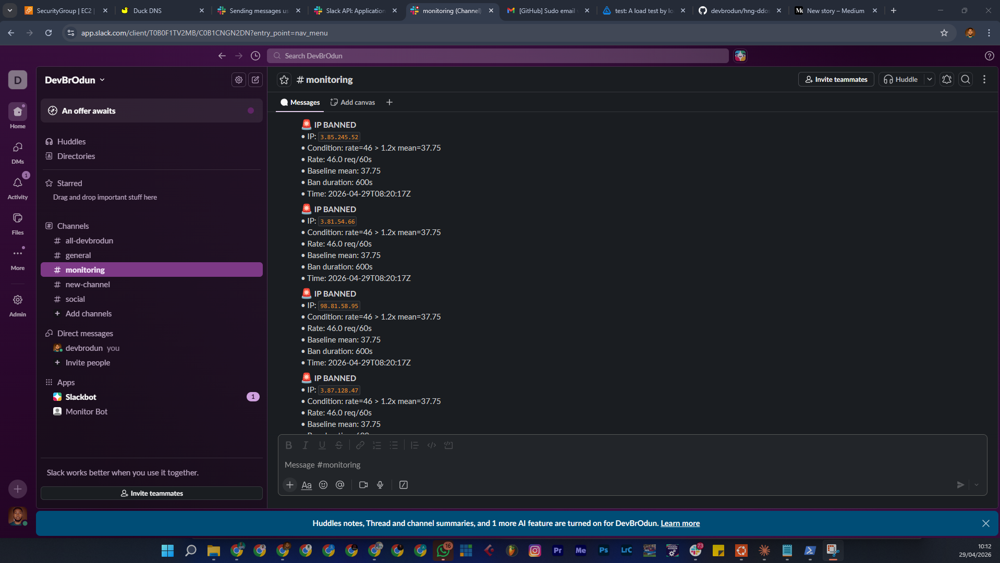
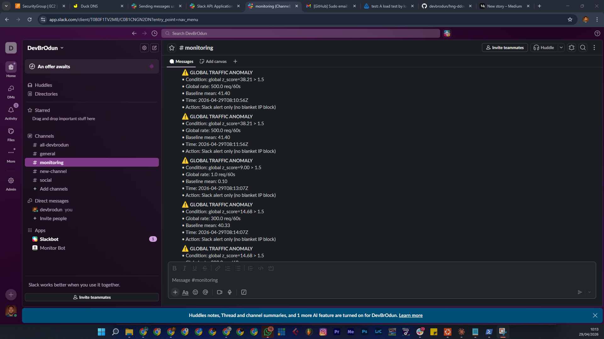

# HNG Anomaly Detection Engine

A real-time DDoS detection and mitigation system built alongside Nextcloud on Docker.

## Live Links
- **Server IP:** http://44.202.222.29 (Nextcloud — accessible by IP only)
- **Dashboard:** https://devbrodun2.duckdns.org
- **GitHub:** https://github.com/devbrodun/hng-ddos-detector
- **Blog Post:** https://medium.com/@fasinaodunayo/how-i-built-a-system-that-automatically-blocks-hackers-in-real-time-4ded87d9a399

## Language Choice
**Python 3.11** — chosen because:
- `asyncio` makes it easy to tail logs, detect anomalies, serve the dashboard, and fire Slack alerts all concurrently
- `collections.deque` is perfect for sliding window implementation
- Readable code that's easy to comment and explain
- `aiohttp` handles async HTTP for Slack notifications

## How the Sliding Window Works
Each IP has a `collections.deque` of request timestamps.

On every request:
1. Append current timestamp to the right of the deque
2. Evict all entries older than 60 seconds from the left (`popleft()`)
3. `len(deque)` = current request rate for that IP

This gives O(1) insertion and eviction. No rate-limiting libraries used — just timestamps and arithmetic.

We maintain two windows:
- **Per-IP window** — tracks individual IP request rates
- **Global window** — tracks total traffic rate across all IPs

## How the Baseline Works
- **Window size:** 30 minutes of per-second request counts
- **Recalculation interval:** Every 60 seconds
- **Per-hour slots:** Current hour's data is preferred when it has ≥5 minutes of samples — prevents yesterday's busy period from masking today's attack
- **Floor values:** minimum mean=0.1, stddev=0.1 — prevents false positives on near-zero traffic
- **What's computed:** mean and standard deviation of per-second request counts

## How Detection Works
Two conditions trigger a flag:
1. **Z-score > 3.0** — rate is 3 standard deviations above baseline mean
2. **Rate > 5x baseline mean** — absolute rate multiplier check

If an IP's 4xx/5xx error rate is 3x the baseline error rate, thresholds are automatically tightened (z-score threshold × 0.6, multiplier × 0.6).

## Blocking & Unban Schedule
- **Per-IP anomaly:** iptables DROP rule added + Slack alert within 10 seconds
- **Global anomaly:** Slack alert only (no blanket IP block)
- **Unban schedule:** 10 min → 30 min → 2 hours → permanent

## Setup Instructions (Fresh VPS)

### 1. Install dependencies
```bash
sudo apt update && sudo apt upgrade -y
curl -fsSL https://get.docker.com | sh
sudo usermod -aG docker $USER
newgrp docker
sudo apt install -y docker-compose-plugin python3 python3-pip nginx certbot python3-certbot-nginx
```

### 2. Clone the repo
```bash
git clone https://github.com/devbrodun/hng-ddos-detector.git
cd hng-ddos-detector
```

### 3. Configure
```bash
cp detector/config.yaml.example detector/config.yaml
nano detector/config.yaml
# Add your Slack webhook URL
# Add your whitelisted IPs
```

### 4. Fix iptables forwarding
```bash
sudo iptables -P FORWARD ACCEPT
sudo apt install -y iptables-persistent
sudo netfilter-persistent save
```

### 5. Start the stack
```bash
docker compose up -d --build
```

### 6. Set Nextcloud trusted domain
```bash
docker compose exec -u 33 nextcloud php occ config:system:set trusted_domains 1 --value="YOUR_SERVER_IP"
```

### 7. Set up SSL for dashboard
```bash
sudo certbot certonly --manual --preferred-challenges dns -d yourdomain.duckdns.org
# Follow prompts to add DNS TXT record via DuckDNS API

sudo bash -c 'cat > /etc/nginx/sites-available/monitor << EOF
server {
    listen 443 ssl;
    server_name yourdomain.duckdns.org;
    ssl_certificate /etc/letsencrypt/live/yourdomain.duckdns.org/fullchain.pem;
    ssl_certificate_key /etc/letsencrypt/live/yourdomain.duckdns.org/privkey.pem;
    location / {
        proxy_pass http://127.0.0.1:8080;
    }
}
EOF'

sudo ln -s /etc/nginx/sites-available/monitor /etc/nginx/sites-enabled/
sudo systemctl restart nginx
```

### 8. Verify everything is running
```bash
docker compose ps
sudo iptables -L INPUT -n
curl https://yourdomain.duckdns.org
```

## Repository Structure
hng-ddos/
├── docker-compose.yml
├── nginx/
│   └── nginx.conf
├── detector/
│   ├── main.py          # Orchestrator — wires all components together
│   ├── monitor.py       # Tails and parses Nginx access log
│   ├── baseline.py      # Rolling 30-min baseline tracker
│   ├── detector.py      # Sliding window anomaly detection
│   ├── blocker.py       # iptables ban/unban + audit log
│   ├── unbanner.py      # Backoff unban scheduler
│   ├── notifier.py      # Slack webhook alerts
│   ├── dashboard.py     # Flask live metrics UI
│   ├── config.yaml.example
│   └── requirements.txt
├── docs/
│   └── architecture.png
├── screenshots/
└── README.md
## Screenshots
### Tool Running


### IP Banned in iptables


### Audit Log


### Slack Ban Alert


### Slack Global Alert


### Dashboard

